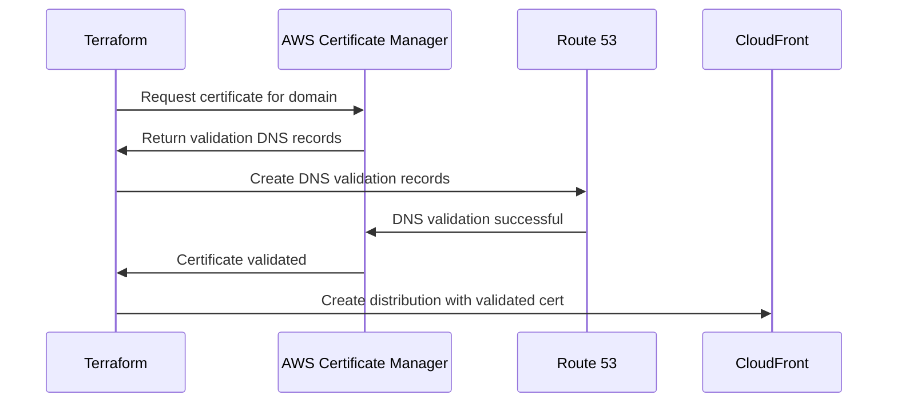

# 🚀 AWS Static Site with CloudFront CDN using Terraform

## 📋 Scenario

As a DevOps engineer in a modern cloud-native company, you're tasked with deploying a secure, scalable static website with global content delivery capabilities. This project demonstrates the complete infrastructure-as-code approach using Terraform to deploy a static website on AWS with SSL/TLS certificates, DNS management, and CloudFront CDN for optimal performance and security.

## 🎯 Core Learning Objectives

- Infrastructure as Code (IaC) with Terraform
- SSL/TLS certificate management with ACM
- DNS management with Route 53
- Static website hosting with S3 and CloudFront
- Security best practices with Origin Access Control
- Global content delivery with CloudFront CDN
- Cross-region resource dependencies

## 🛠️ Tech Stack & Rationale

| Technology                                                                                                        | Purpose                   | Rationale                                                                 |
| ----------------------------------------------------------------------------------------------------------------- | ------------------------- | ------------------------------------------------------------------------- |
|              | Infrastructure as Code    | Industry standard for cloud infrastructure automation and version control |
|                | Static File Storage       | Cost-effective, highly durable storage for static website files           |
|   | Content Delivery Network  | Global edge locations for fast content delivery and DDoS protection       |
|     | DNS Management            | Highly available DNS service with health checks and routing policies      |
|  | SSL/TLS Certificates      | Free SSL certificates with automatic renewal and CloudFront integration   |
|                | Security & Access Control | Fine-grained permissions and secure resource access management            |

## 📋 Implementation Steps

### Step 1: Environment Setup and Prerequisites

Configure your AWS credentials and Terraform environment

```bash
# Install AWS CLI
curl "https://awscli.amazonaws.com/awscli-exe-linux-x86_64.zip" -o "awscliv2.zip"
unzip awscliv2.zip
sudo ./aws/install

# Configure AWS credentials
aws configure
# Enter your Access Key ID, Secret Access Key, Default region, and output format

# Install Terraform
wget https://releases.hashicorp.com/terraform/1.8.0/terraform_1.8.0_linux_amd64.zip
unzip terraform_1.8.0_linux_amd64.zip
sudo mv terraform /usr/local/bin/

# Verify installations
aws --version
terraform --version
```

**Why this step is critical:**

- AWS CLI provides secure authentication for Terraform to manage AWS resources
- Proper credential configuration prevents unauthorized access and ensures resource ownership

### Step 2: Provider Configuration Setup

Configure Terraform providers for multi-region AWS deployment

```hcl
# provider.tf
terraform {
  required_providers {
    aws = {
      source  = "hashicorp/aws"
      version = "~> 6.0"
    }
  }
}

provider "aws" {
  region = "ap-south-1"
}

provider "aws" {
  alias  = "us_east_1"
  region = "us-east-1" # For ACM Certificate used by CloudFront
}
```

**Why dual providers are needed:**

- CloudFront requires SSL certificates to be created in `us-east-1` region specifically
- Main resources can be deployed in any region for cost optimization and latency reduction

### Step 3: Route 53 Hosted Zone Creation

Set up DNS management for your custom domain

```hcl
# Create the main Hosted Zone for your domain
resource "aws_route53_zone" "custom_domain" {
  name = "makemydemo.xyz"
}
```

**Why Route 53 comes first:**

- DNS validation for SSL certificates requires an active hosted zone
- Provides authoritative DNS servers that must be configured with your domain registrar

**After Creation of Hosted Zone:**


### Step 4: SSL Certificate Creation and DNS Validation

Create and validate SSL certificates using ACM with DNS validation

```hcl
# Create ACM Certificate in us-east-1 for both root and www domains
resource "aws_acm_certificate" "cert" {
  provider                  = aws.us_east_1
  domain_name               = "makemydemo.xyz"
  subject_alternative_names = ["www.makemydemo.xyz"]
  validation_method         = "DNS"

  lifecycle {
    create_before_destroy = true
  }
}

# Create DNS records in Route 53 to validate the certificate
resource "aws_route53_record" "cert_validation" {
  for_each = {
    for dvo in aws_acm_certificate.cert.domain_validation_options : dvo.domain_name => {
      name   = dvo.resource_record_name
      record = dvo.resource_record_value
      type   = dvo.resource_record_type
    }
  }
  allow_overwrite = true
  name            = each.value.name
  records         = [each.value.record]
  ttl             = 60
  type            = each.value.type
  zone_id         = aws_route53_zone.custom_domain.zone_id
}

# Wait for the certificate validation to complete
resource "aws_acm_certificate_validation" "cert_validation" {
  provider                = aws.us_east_1
  certificate_arn         = aws_acm_certificate.cert.arn
  validation_record_fqdns = [for record in aws_route53_record.cert_validation : record.fqdn]
}
```
**Why DNS validation over email validation:**

- Automated validation process that doesn't require manual intervention
- Enables automatic certificate renewal without human interaction

**After Validation Completion:**


### Step 5: S3 Bucket Configuration with Security

Create a private S3 bucket with public access blocked

```hcl
# Create the S3 bucket to store website files
resource "aws_s3_bucket" "bucket_s3" {
  bucket = var.s3_bucket_name
}

# Block all public access to the S3 bucket
resource "aws_s3_bucket_public_access_block" "bucket_s3_public_access" {
  bucket = aws_s3_bucket.bucket_s3.id

  block_public_acls       = true
  block_public_policy     = true
  ignore_public_acls      = true
  restrict_public_buckets = true
}
```

**Why private S3 bucket is more secure:**

- Prevents direct public access to S3 content, forcing traffic through CloudFront
- Protects against DDoS attacks and unauthorized access to origin server

**After Completion of Creation of Bucket:**


### Step 6: Website Content Upload

Upload static website files to S3 with proper content types

```hcl
# Upload website files to the S3 bucket
resource "aws_s3_object" "index_html" {
  bucket       = aws_s3_bucket.bucket_s3.id
  key          = "index.html"
  source       = "index.html"
  content_type = "text/html"
}

resource "aws_s3_object" "error_html" {
  bucket       = aws_s3_bucket.bucket_s3.id
  key          = "error.html"
  source       = "error.html"
  content_type = "text/html"
}

resource "aws_s3_object" "goku_jpeg" {
  bucket       = aws_s3_bucket.bucket_s3.id
  key          = "goku.jpeg"
  source       = "goku.jpeg"
  content_type = "image/jpeg"
}
```

**Why proper content types matter:**

- Ensures browsers interpret files correctly (HTML as web pages, images as images)
- Improves SEO and user experience by setting appropriate MIME types

**After Completion of Uploading:**


### Step 7: Origin Access Control (OAC) Setup

Create secure access control for CloudFront to S3 communication

```hcl
# Create a secure Origin Access Control (OAC) for CloudFront
resource "aws_cloudfront_origin_access_control" "oac" {
  name                              = "OAC for makemydemo.xyz"
  origin_access_control_origin_type = "s3"
  signing_behavior                  = "always"
  signing_protocol                  = "sigv4"
}
```

**Why OAC over Legacy OAI:**

- OAC supports all S3 bucket configurations including SSE-KMS encryption
- More secure with SigV4 signing and better integration with S3

### Step 8: CloudFront Distribution Configuration

Configure CloudFront distribution with SSL certificate and caching policies

```hcl
resource "aws_cloudfront_distribution" "s3_distribution" {
  origin {
    domain_name              = aws_s3_bucket.bucket_s3.bucket_regional_domain_name
    origin_id                = "S3-${var.s3_bucket_name}"
    origin_access_control_id = aws_cloudfront_origin_access_control.oac.id
  }

  enabled             = true
  is_ipv6_enabled     = true
  comment             = "CloudFront for makemydemo.xyz"
  default_root_object = "index.html"

  aliases = ["makemydemo.xyz", "www.makemydemo.xyz"]

  default_cache_behavior {
    allowed_methods  = ["GET", "HEAD", "OPTIONS"]
    cached_methods   = ["GET", "HEAD"]
    target_origin_id = "S3-${var.s3_bucket_name}"

    viewer_protocol_policy = "redirect-to-https"
    min_ttl                = 0
    default_ttl            = 3600
    max_ttl                = 86400

    forwarded_values {
      query_string = false
      cookies {
        forward = "none"
      }
    }
  }

  price_class = "PriceClass_All"

  restrictions {
    geo_restriction {
      restriction_type = "none"
    }
  }

  viewer_certificate {
    # CRITICAL: Use the ARN from the *validation* resource
    acm_certificate_arn      = aws_acm_certificate_validation.cert_validation.certificate_arn
    ssl_support_method       = "sni-only"
    minimum_protocol_version = "TLSv1.2_2021"
  }
}
```

**Critical SSL certificate configuration explanation:**

- `acm_certificate_arn` uses the validation resource ARN, not the certificate ARN directly
- This ensures Terraform waits for certificate validation before creating CloudFront distribution

**Why `sni-only` and `TLSv1.2_2021`:**

- SNI (Server Name Indication) reduces costs compared to dedicated IP
- TLS 1.2 minimum ensures modern security standards while maintaining broad compatibility

**After Completion of CloudFront Creation:**


### Step 9: S3 Bucket Policy for CloudFront Access

Create secure bucket policy allowing only CloudFront access

```hcl
# Create a secure bucket policy that ONLY allows access from CloudFront
resource "aws_s3_bucket_policy" "bucket_s3_policy" {
  bucket = aws_s3_bucket.bucket_s3.id
  policy = jsonencode({
    Version = "2012-10-17",
    Statement = [
      {
        Effect    = "Allow",
        Principal = { Service = "cloudfront.amazonaws.com" },
        Action    = "s3:GetObject",
        Resource  = "${aws_s3_bucket.bucket_s3.arn}/*",
        Condition = {
          StringEquals = {
            "AWS:SourceArn" = aws_cloudfront_distribution.s3_distribution.arn
          }
        }
      }
    ]
  })
}
```

**Why SourceArn condition is critical:**

- Prevents other CloudFront distributions from accessing your S3 bucket
- Creates a one-to-one secure relationship between specific CloudFront and S3

### Step 10: DNS Records for Domain Routing

Create DNS A records pointing to CloudFront distribution

```hcl
# Create DNS 'A' record for the root domain
resource "aws_route53_record" "root" {
  zone_id = aws_route53_zone.custom_domain.zone_id
  name    = "makemydemo.xyz"
  type    = "A"

  alias {
    name                   = aws_cloudfront_distribution.s3_distribution.domain_name
    zone_id                = aws_cloudfront_distribution.s3_distribution.hosted_zone_id
    evaluate_target_health = false
  }
}

# Create DNS 'A' record for the 'www' subdomain
resource "aws_route53_record" "www" {
  zone_id = aws_route53_zone.custom_domain.zone_id
  name    = "www.makemydemo.xyz"
  type    = "A"

  alias {
    name                   = aws_cloudfront_distribution.s3_distribution.domain_name
    zone_id                = aws_cloudfront_distribution.s3_distribution.hosted_zone_id
    evaluate_target_health = false
  }
}
```

**Why alias records over CNAME:**

- Alias records can be used for root domains (CNAME cannot)
- No additional DNS lookup overhead, providing faster resolution


## 🛸 Verification

**Open Browser and Check Network:**


## 🏗️ Architecture Overview

```
┌─────────────────┐    ┌─────────────────┐    ┌─────────────────┐
│     Client      │    │   Route 53      │    │   CloudFront    │
│                 │────│   DNS Service   │────│   CDN (Global)  │
│   (Browser)     │    │                 │    │                 │
└─────────────────┘    └─────────────────┘    └─────────────────┘
                                                        │
                       ┌─────────────────┐              │
                       │   ACM (SSL)     │              │
                       │   us-east-1     │──────────────┘
                       └─────────────────┘
                                                        │
                                                        ▼
                                               ┌─────────────────┐
                                               │   S3 Bucket     │
                                               │   (Private)     │
                                               │   ap-south-1    │
                                               └─────────────────┘
```

## 📊 Resource Dependencies

### Critical Dependency Chain

```bash
1. Route 53 Hosted Zone → Created first for DNS validation
2. ACM Certificate → Depends on hosted zone for DNS validation
3. Certificate Validation → Waits for DNS records and certificate
4. CloudFront Distribution → Uses validated certificate ARN
5. S3 Bucket Policy → References CloudFront distribution ARN
6. DNS A Records → Point to CloudFront domain
```

## 🗃️ Variables Configuration

```hcl
# variables.tf
variable "s3_bucket_name" {
  description = "The name of the S3 bucket to create"
  type        = string
  default     = "terraform-bucket-zimo"
}
```

**Customize for your deployment:**

- Change bucket name to something globally unique
- Consider adding variables for domain name and region

## 🔧 Deployment Commands

### Initialize and Deploy

```bash
# Initialize Terraform
terraform init

# Plan the deployment
terraform plan

# Apply the configuration
terraform apply

# Confirm with 'yes' when prompted
```

### Domain Registrar Configuration

```bash
# After deployment, configure your domain registrar with Route 53 nameservers
# Get nameservers from terraform output:
terraform output route53_name_servers

# Example nameservers to add to your domain registrar:
# ns-1234.awsdns-56.org
# ns-789.awsdns-01.net
# ns-234.awsdns-56.com
# ns-567.awsdns-78.co.uk
```


**Why nameserver configuration is required:**

- Domain registrar needs to delegate DNS authority to Route 53
- Without this step, your domain won't resolve to the CloudFront distribution

## 💾 Output Information

After successful deployment, Terraform provides important endpoints:

```bash
# View all outputs
terraform output

# Expected outputs:
# cloudfront_url = "https://d1234567890.cloudfront.net"
# route53_name_servers = ["ns-xxx.awsdns-xx.org", ...]
# s3_bucket_name = "terraform-bucket-zimo"
# acm_certificate_arn = "arn:aws:acm:us-east-1:123456789:certificate/abc-123"
```

## 🔄 SSL Certificate Validation Process



## 🏥 Security Best Practices Implemented

### S3 Bucket Security

- **Private bucket**: No public read access
- **Bucket policy**: Only CloudFront can access content
- **OAC**: Modern secure access control method

### SSL/TLS Security

- **Modern TLS**: Minimum TLS 1.2 required
- **HTTPS redirect**: All HTTP traffic redirected to HTTPS
- **SNI**: Cost-effective SSL termination

### DNS Security

- **Route 53**: AWS-managed, highly available DNS
- **Alias records**: Optimal performance and security

## 🛑 Managing the Deployment

### Update Website Content

```bash
# Modify your HTML files locally
# Apply changes to update S3 objects
terraform apply

# Invalidate CloudFront cache for immediate updates
aws cloudfront create-invalidation \
  --distribution-id $(terraform output -raw cloudfront_distribution_id) \
  --paths "/*"
```

### Clean Up Resources

```bash
# Destroy all resources (careful!)
terraform destroy

# Confirm with 'yes' when prompted
```

### Monitor and Troubleshoot

```bash
# Check CloudFront distribution status
aws cloudfront get-distribution \
  --id $(terraform output -raw cloudfront_distribution_id)

# Test SSL certificate
openssl s_client -connect makemydemo.xyz:443 -servername makemydemo.xyz

# DNS resolution test
dig makemydemo.xyz
nslookup makemydemo.xyz
```

## 🔍 Troubleshooting Guide

### Common Issues

1. **Certificate validation timeout**

   - Verify nameservers are configured at domain registrar
   - Check DNS propagation with `dig` or online tools

2. **CloudFront 403 errors**

   - Verify S3 bucket policy allows CloudFront access
   - Check OAC configuration and S3 object permissions

3. **Domain not resolving**
   - Confirm Route 53 nameservers in domain registrar
   - Wait for DNS propagation (up to 48 hours)

### Debug Commands

```bash
# Check Terraform state
terraform show

# Validate configuration
terraform validate

# Format configuration files
terraform fmt

# Check for security issues
terraform plan | grep -i "error\|warning"
```

## 📈 Performance Optimizations

### CloudFront Configuration

- **Price Class All**: Global edge locations for best performance
- **Cache TTL**: Optimized for static content (1 hour default)
- **Compression**: Automatic gzip compression enabled

### S3 Configuration

- **Regional bucket**: Reduced latency to CloudFront origin
- **Proper content types**: Optimal browser caching behavior

## 🌐 Global Architecture Benefits

This architecture provides:

- **High Availability**: Multi-AZ deployment across AWS regions
- **Global Performance**: CloudFront edge locations worldwide
- **Security**: Private S3 bucket with CloudFront-only access
- **Cost Optimization**: S3 storage with CloudFront caching
- **Automatic Scaling**: Handles traffic spikes automatically
- **SSL Encryption**: End-to-end HTTPS with modern TLS

This Terraform AWS Static Site CDN deployment demonstrates modern cloud architecture principles with security, performance, and scalability at its core - perfect for learning infrastructure automation and AWS best practices.
